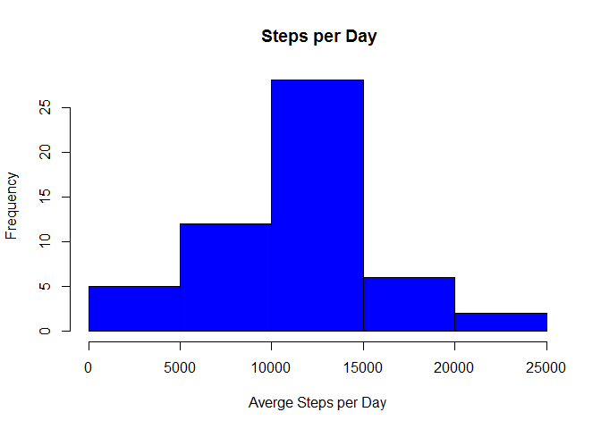
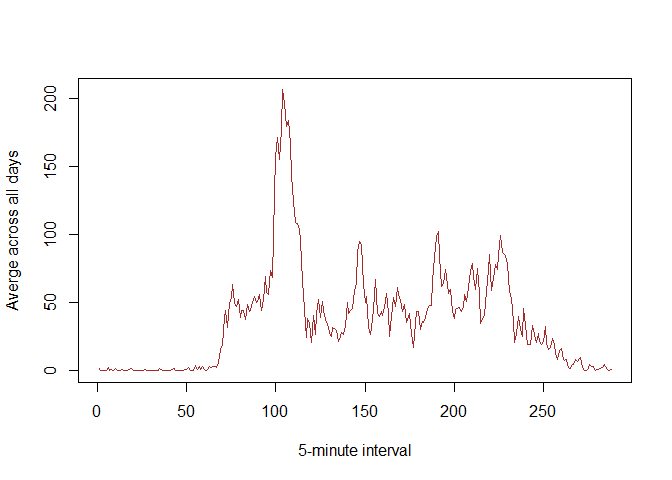
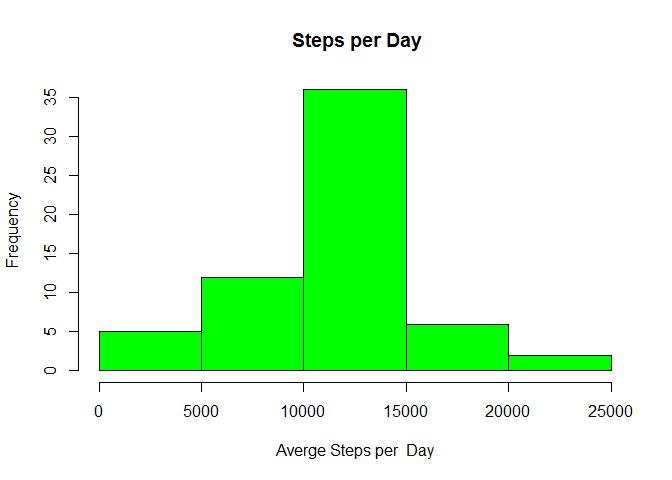

# Reproducible Research: Peer Assessment 1


## Loading and preprocessing the data  

```r
dat <- read.csv("activity.csv")  
dat$date <- as.Date(dat$date, format="%Y-%m-%d")  
```
## What is mean total number of steps taken per day?  

Histogram of the total number of steps taken each day  

```r
totalstps <- aggregate(steps ~ date, data=dat, FUN = sum)  
hist(totalstps$steps, main = " Steps per Day", col = "Blue", xlab = "Averge Steps per Day")  
```



Mean and median of the total number of steps taken per day  

```r
mean(totalstps$steps)  
```

```
## [1] 10766.19
```

```r
median(totalstps$steps)  
```

```
## [1] 10765
```
## What is the average daily activity pattern?  

Time series plot of the 5-minute interval & the average number of steps taken, averaged across all days   

```r
newdata <- tapply(dat$steps, dat$interval, mean, na.rm=TRUE)  
plot(newdata, type = "l", xlab = "5-minute interval",   
     ylab = "Averge across all days", col="brown")  
```


  
Which 5-minute interval, on average across all the days in the dataset, contains the maximum number of steps?  

```r
names(which.max(newdata))  
```

```
## [1] "835"
```
## Imputing missing values  

Total number of missing values in the dataset  

```r
sum(is.na(dat))  
```

```
## [1] 2304
```

Filling in all of the missing values in the dataset.  

```r
stepsAverage <- aggregate(steps ~ interval, data=dat, FUN = mean)  
fillNA <- numeric()  
for (i in 1:nrow(dat)) {  
        newdf <- dat[i,]     
        if (is.na(newdf$steps)){  
                steps <- subset(stepsAverage, interval == newdf$interval)$steps  
        } else {  
                steps <- newdf$steps  
        }  
        fillNA <- c(fillNA,steps)  
}   
```

New dataset with the missing data filled in  

```r
newdat <- dat  
newdat$steps <- fillNA  
```
Histogram of the total number of steps with the new dataset   
  

```r
newstps <- aggregate(steps ~ date, data=newdat, FUN = sum)   
hist(newstps$steps, main = " Steps per Day", col = "Green", xlab = "Averge Steps per  Day")  
```



```r
mean(newstps$steps)  
```

```
## [1] 10766.19
```

```r
median(newstps$steps)  
```

```
## [1] 10766.19
```
  
There is changes in median caused a small increase but mean is the same in both cases   

## Are there differences in activity patterns between weekdays and weekends?  

New factor variable in the dataset with two levels – “weekday” & “weekend”  

```r
newdat$date <- as.Date(newdat$date)  

library(timeDate)  
newdat$wDay <- isWeekday(newdat$date, wday=1:5)   
newdat$wDay <- ifelse(newdat$wDay == TRUE, "Weekday", "Weekend")  
```
Panel plot containing a time series plot the 5-minute interval& the average number of steps taken, averaged across all weekday days  
  

```r
paneldat <- aggregate(steps ~ interval + wDay, data = newdat, FUN=mean)  
library(lattice)  
xyplot(steps ~ interval| factor(wDay), data = paneldat, type = "l", layout=c(1,2))  
```


